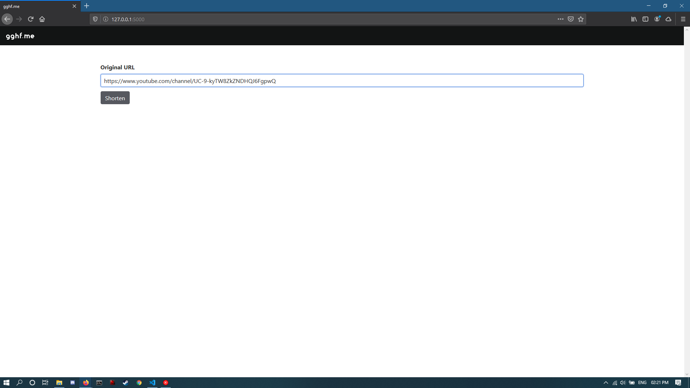
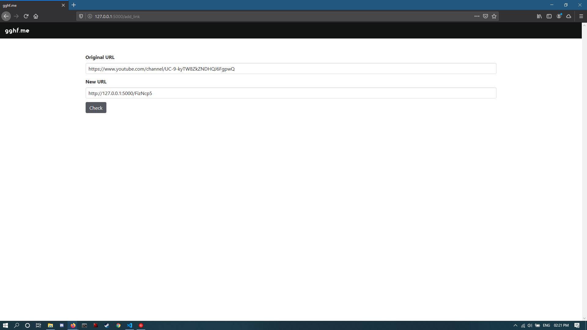
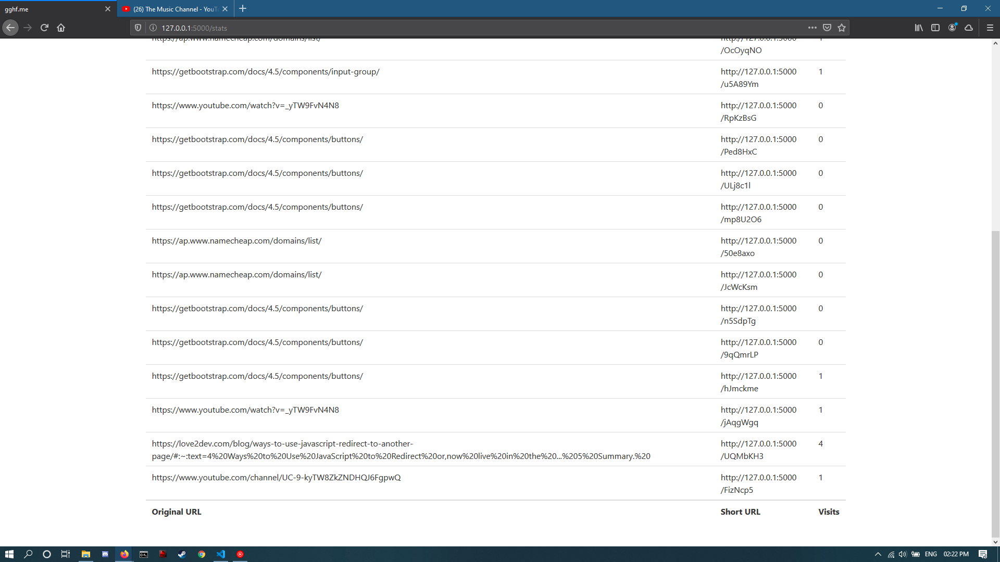

# A URL shortening service

A scalable, lightning-fast URL  shortening service with tracking the URL's to get usage statistics.


## Getting Started

These instructions will get you a copy of the project up and running on your local machine for development and testing purposes.

### Prerequisites

Need to install python pipenv tool for creating and managing the virtual environment.

```
$ pip install pipenv
```

### Installing

A step by step series of examples that tell you how to get a development env running

1. Clone the git repository on local computer.
```
$ git clone https://github.com/iBvishal/url_shortener.git
```
2. Activate the virtual environment and install requirements.
```
$ cd url_shortener
$ pipenv shell
$ pip install -r requirements.txt
```
3. Run the flask app and open http://127.0.0.1:5000/ in browser window.
```
$ flask run
```

## Screenshots







## Built With


* [Flask](https://flask.palletsprojects.com/en/1.1.x/) - The web framework used
* [Bulma](https://bulma.io/) - open source CSS framework based on Flexbox


## Authors

* **Vishal Bhardwaj** -  [iBvishal](https://github.com/iBvishal)

See also the list of [contributors](https://github.com/iBvishal/url_shortener/contributors) who participated in this project.

## License

This project is licensed under the GNU General Public License v3.0 - see the [LICENSE.md](LICENSE.md) file for details


### Show some :heart: and do star the repo
